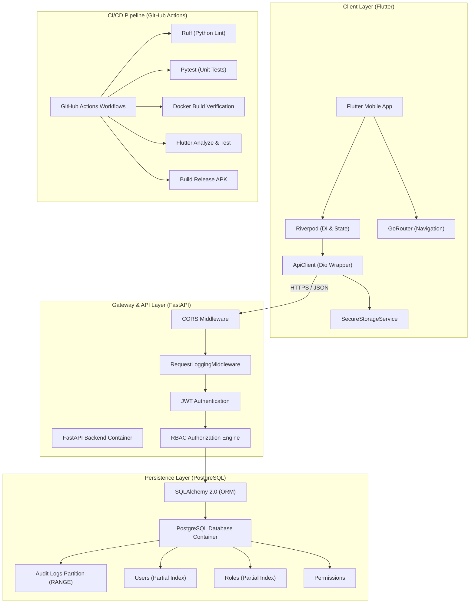
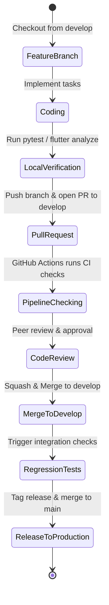
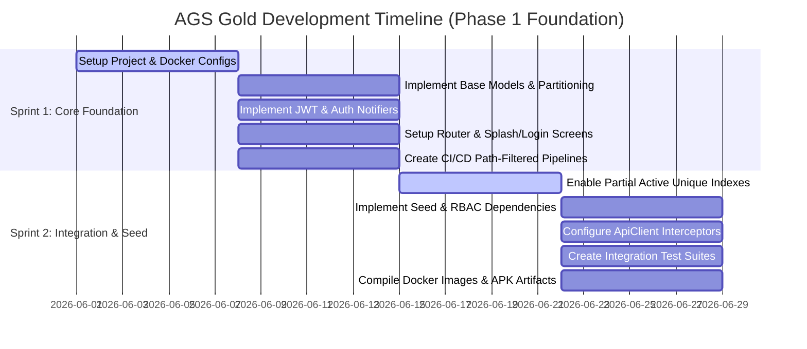

# AGS Gold Enterprise Platform

AGS Gold is an enterprise-grade platform built on a decoupled, high-performance architecture comprising a FastAPI backend, a PostgreSQL relational database, and a cross-platform Flutter mobile client. The platform incorporates Role-Based Access Control (RBAC), JWT Authentication, automated audit logging, database partitioning, and automated CI/CD pipelines via GitHub Actions.

---

## Architecture Diagram



---

## Technology Stack

| Component | Technology | Version | Description |
| :--- | :--- | :--- | :--- |
| **Backend** | Python / FastAPI | `3.12+` / `0.110.0+` | High-performance async API Gateway |
| **Database** | PostgreSQL / asyncpg | `16+` / `0.29.0+` | Relational storage with range partitioning |
| **ORM & Migrations** | SQLAlchemy / Alembic | `2.0+` / `1.13.0+` | Async declarative mapping and schemas |
| **Mobile Client** | Flutter / Dart | `3.44+` / `3.12+` | Cross-platform Material 3 client |
| **State & Navigation** | Riverpod / GoRouter | `3.0+` / `17.0+` | Reactively managed DI and route guards |
| **CI/CD & DevOps** | Docker / GitHub Actions | `v25+` / `v4+` | Automated testing and build compilation |

---

## Repository Structure

```text
.github/
└── workflows/
    ├── backend.yml                 # FastAPI Lint, Test, and Docker Build
    └── flutter.yml                 # Flutter Analyze, Test, and Build APK
backend/
├── alembic/
│   └── versions/                   # Alembic schema migration files
├── app/
│   ├── api/                        # Health check and endpoint routers
│   ├── core/                       # Configurations, exceptions, logging
│   ├── database/                   # DB engine, session maker, seed scripts
│   ├── middleware/                 # CORS and request logger middlewares
│   ├── models/                     # SQLAlchemy models (User, Role, AuditLog)
│   └── main.py                     # FastAPI application bootstrap
├── tests/                          # Pytest integration/unit test suites
├── alembic.ini                     # Alembic configuration
├── Dockerfile                      # Multistage production Docker build
├── docker-compose.yml              # PostgreSQL development container
└── requirements.txt                # Python package list
frontend/
├── lib/
│   ├── config/                     # Dev/Prod environment configuration
│   ├── core/                       # Themes and Responsive layout helpers
│   ├── features/                   # Splash, Login, and Dashboard modules
│   ├── routes/                     # GoRouter setup and navigation guards
│   ├── services/                   # Storage contracts, API and providers
│   └── main.dart                   # Flutter application bootstrap
└── pubspec.yaml                    # Dart package dependencies
```

---

## Local Development Setup

### Backend API Setup

1. **Navigate to the Backend Directory**:
   ```bash
   cd backend
   ```
2. **Create and Activate a Virtual Environment**:
   ```bash
   python -m venv .venv
   # Windows PowerShell
   .\.venv\Scripts\Activate.ps1
   # macOS/Linux
   source .venv/bin/activate
   ```
3. **Install Dependencies**:
   ```bash
   pip install --upgrade pip
   pip install -r requirements.txt
   ```
4. **Environment Configuration**:
   Create a `.env` file in `/backend` using the variables defined in `Environment Variables` section.
5. **Run Database Migrations**:
   ```bash
   python -m alembic upgrade head
   ```
6. **Seed Initial Database Records**:
   ```bash
   python app/database/seed.py
   ```
7. **Run the Development Server**:
   ```bash
   uvicorn app.main:app --reload --port 8000
   ```

### Flutter Mobile App Setup

1. **Navigate to the Frontend Directory**:
   ```bash
   cd frontend
   ```
2. **Install Flutter Dependencies**:
   ```bash
   flutter pub get
   ```
3. **Validate Code Health & Types**:
   ```bash
   flutter analyze
   ```
4. **Run Unit Tests**:
   ```bash
   flutter test
   ```
5. **Run the Client App**:
   ```bash
   # Running on default connected emulator/browser
   flutter run
   # Running with custom environment variables
   flutter run --dart-define=ENV=dev
   ```

---

## Environment Variables

Create a `.env` file in the `backend/` directory:

```env
# General
ENVIRONMENT=development
PROJECT_NAME="AGS Gold API"

# Security
SECRET_KEY=generate-a-secure-random-token-key-for-prod
ACCESS_TOKEN_EXPIRE_MINUTES=60
SUPERADMIN_PASSWORD=change-me-in-production

# Database (Local Docker Port is 5435)
POSTGRES_SERVER=localhost
POSTGRES_PORT=5435
POSTGRES_USER=postgres
POSTGRES_PASSWORD=password123
POSTGRES_DB=ags_gold_db

# CORS (Comma-separated values)
BACKEND_CORS_ORIGINS=http://localhost:3000,http://localhost:8080
```

---

## Docker Setup

Spin up the local PostgreSQL instance on port `5435` (mapped to `5432` internally to avoid native system conflicts):

1. **Launch Containers**:
   ```bash
   cd backend
   docker compose up -d
   ```
2. **Verify Logs**:
   ```bash
   docker compose logs -f db
   ```
3. **Shutdown Services**:
   ```bash
   docker compose down -v
   ```

---

## Database Migration Process

Altering database schemas requires generating and applying migrations:

1. **Autogenerate a new migration revision**:
   ```bash
   # Set PYTHONPATH to root backend folder
   $env:PYTHONPATH="."
   python -m alembic revision --autogenerate -m "describe_changes"
   ```
2. **Review the generated file** under `backend/alembic/versions/` for correctness.
3. **Apply the migration to the database**:
   ```bash
   python -m alembic upgrade head
   ```
4. **Rollback the last migration (if needed)**:
   ```bash
   python -m alembic downgrade -1
   ```

---

## Git Workflow & Branch Strategy

We follow a strict Git Flow model. No developer is allowed to push directly to the protected `main` and `develop` branches.

### Branch Strategy

- **`main`**: Production-only branch. Code must be fully tested, verified, and tagged.
- **`develop`**: Integration branch. Feature branches merge here for verification.
- **`feature/*`**: Individual developer branches created from `develop`.
- **`bugfix/*`**: Hotfixes targeted at resolving specific integration issues.

### Pull Request Process

1. Create a branch from `develop`: `git checkout -b feature/user-crud`.
2. Commit logic using clear commits.
3. Push to origin: `git push -u origin feature/user-crud`.
4. Open a Pull Request (PR) targeting `develop`.
5. **Requirements for Merging**:
   - The Pull Request must pass all GitHub Actions automated workflows.
   - Requires at least 1 peer-review approval from the team.
   - Merging is completed only via a "Squash and Merge" operation.

---

## CI/CD Pipeline

The GitHub Actions workflows reside in `.github/workflows/`:

```mermaid
flowchart TD
    %% Backend
    subgraph BE ["Backend Workflow (backend.yml)"]
        BE_Trigger["Push/PR to main/develop (on backend/**)"]
        BE_Lint["Ruff Lint & Format Checks"]
        BE_Test["Pytest Integration Tests"]
        BE_Docker["Docker Image Compile Verification"]
        
        BE_Trigger --> BE_Lint
        BE_Lint --> BE_Test
        BE_Test --> BE_Docker
    end

    %% Flutter
    subgraph FL ["Flutter Workflow (flutter.yml)"]
        FL_Trigger["Push/PR to main/develop (on frontend/**)"]
        FL_Analyze["Flutter Analyze & Lints"]
        FL_Test["Flutter Test Suite"]
        FL_Build["Flutter Build APK (Release)"]
        FL_Artifact["Upload app-release.apk Artifact"]
        
        FL_Trigger --> FL_Analyze
        FL_Analyze --> FL_Test
        FL_Test --> FL_Build
        FL_Build --> FL_Artifact
    end
```



---

## Coding Standards

- **Python**: Enforced via `ruff`. Run `ruff check backend/` and `ruff format backend/` prior to committing.
- **Flutter**: Enforced via `flutter analyze`. Code must register 0 lints, 0 warnings, and 0 deprecations. Use super parameters and dynamic platform getters where applicable.

---

## Definition of Done (DoD)

A task is considered **Done** only when:
- [ ] Code complies fully with PEP 8 (via Ruff) and Dart styling rules.
- [ ] Code compiles without warning, info, or error logs.
- [ ] Unit/Integration tests cover all new functionalities.
- [ ] Database migrations are generated, reviewed, and applied successfully.
- [ ] Automated CI pipeline builds pass completely on the PR.
- [ ] The PR has been reviewed and approved by at least 1 team member.

---

## Developer Allocation & Responsibilities

### Developer 1 – Backend Foundation & Security
- **Responsibilities**: Design and own the security middleware, authorization engine, JWT authentication framework, and core audit logging functionality.
- **Folder Ownership**:
  - `backend/app/core/` (Security configs, exceptions)
  - `backend/app/middleware/` (Security and logger middlewares)
- **Branch Naming**: `feature/auth-security-*`
- **Sprint 1 Tasks**:
  - Implement the core JWT encoding/decoding and token expiration validation utilities.
  - Implement logging middlewares capturing payload signatures without leaking plaintext passwords.
- **Sprint 2 Tasks**:
  - Build the RBAC validation decorator/dependency to enforce permissions on API routes.
  - Set up audit log interceptors to log mutations to the database.
- **Acceptance Criteria**:
  - Invalid JWT tokens yield `401 Unauthorized` responses.
  - Endpoint routes enforce RBAC checks, yielding `403 Forbidden` if the user's role lacks permissions.

### Developer 2 – Database & Infrastructure
- **Responsibilities**: Own database engines, session configurations, SQLAlchemy base models, migrations, and docker containers.
- **Folder Ownership**:
  - `backend/app/database/` (Engines, seed scripts)
  - `backend/app/models/` (User, Role, Permission models)
  - `backend/alembic/` (Migrations)
- **Branch Naming**: `feature/db-infra-*`
- **Sprint 1 Tasks**:
  - Build declarative base mixins for UUID primary keys, timezone timestamps, and soft deletes.
  - Set up PostgreSQL range partitioning on the `audit_logs` table.
- **Sprint 2 Tasks**:
  - Configure partial active unique indexes for users/roles to prevent key blocks on soft-deletes.
  - Implement idempotent seed scripts to load initial Roles and Permissions.
- **Acceptance Criteria**:
  - Deleting a user soft-deletes their profile (`is_deleted=True`) without throwing SQL constraints errors during subsequent registration with the same email.
  - Seeding is idempotent and runs cleanly.

### Developer 3 – Flutter Foundation
- **Responsibilities**: Manage the mobile client architecture, routing guards, Material 3 themes, state notifier providers, and API wrapper client.
- **Folder Ownership**:
  - `frontend/lib/core/` (Themes, responsive builders)
  - `frontend/lib/services/` (Providers, storage contracts, api clients)
  - `frontend/lib/routes/` (Routing configuration)
- **Branch Naming**: `feature/flutter-core-*`
- **Sprint 1 Tasks**:
  - Setup GoRouter router with splash, login, and dashboard pathways.
  - Implement the Riverpod `AsyncNotifier` to handle async session checks during splash loading.
- **Sprint 2 Tasks**:
  - Build the `ApiClient` wrapping `Dio` with interceptors mapping network errors to exceptions.
  - Implement the Material 3 light/dark system themes.
- **Acceptance Criteria**:
  - Unauthenticated routes redirect to `/login`.
  - API exceptions (401, 422, 500) map to custom exception objects instead of leaking raw network trace blocks.

### Developer 4 – User Management Module
- **Responsibilities**: Build APIs and UI screens managing user profile configurations, roles association, and capability checks.
- **Folder Ownership**:
  - `backend/app/api/users/` (User routers)
  - `frontend/lib/features/auth/` (Login views)
  - `frontend/lib/features/users/` (Users management views)
- **Branch Naming**: `feature/user-management-*`
- **Sprint 1 Tasks**:
  - Build the Login UI Screen supporting input validations (regex checks for email, password non-empty).
  - Implement user creation, update, and search API routers.
- **Sprint 2 Tasks**:
  - Create screens allowing administrators to search users and assign roles.
  - Link profiles to audit trails logs on the UI.
- **Acceptance Criteria**:
  - Submitting validation-failing login inputs shows error alerts without executing network operations.
  - Administrators can toggle and persist role mappings on profiles.

### Developer 5 – Business Modules
- **Responsibilities**: Build business logic endpoints for customer profiles, inventory items, transactions ledger, and reports exports.
- **Folder Ownership**:
  - `backend/app/api/business/`
  - `frontend/lib/features/business/`
- **Branch Naming**: `feature/business-logic-*`
- **Sprint 1 Tasks**:
  - Build inventory ledger entities and routers.
  - Setup transactional tables mapping deposits and vault withdrawals.
- **Sprint 2 Tasks**:
  - Create transaction listing and reports summary APIs.
  - Wire business endpoints to the audit trail system.
- **Acceptance Criteria**:
  - Gold vault transactions check active inventory constraints before mutating database states.

### Developer 6 – DevOps & Quality Engineering
- **Responsibilities**: Maintain CI/CD pipelines, automated testing, quality gates, logs, and deployment workflows.
- **Folder Ownership**:
  - `.github/workflows/` (Actions)
  - `backend/tests/` (Pytest files)
- **Branch Naming**: `feature/devops-qa-*`
- **Sprint 1 Tasks**:
  - Write path-filtered GitHub Actions pipelines (`backend.yml` and `flutter.yml`).
  - Configure caching steps for pip packages and pub dependencies to optimize execution times.
- **Sprint 2 Tasks**:
  - Create integration test suites asserting API handler mappings.
  - Implement automated Docker builds and APK artifact publishing.
- **Acceptance Criteria**:
  - Committing broken code triggers pipeline failures and locks pull request merges.
  - Pipeline compile steps publish executable APK releases successfully.

---

## Development Workflow



---

## Sprint Timeline



---

## Deployment Process

The AGS Gold platform foundation utilizes automated packaging for deployment:

### Backend Docker Container Deployment
1. Every successful merge to `main` builds the production Docker image using a multi-stage configuration:
   - **Stage 1 (Builder)**: Compiles packages and builds dependencies.
   - **Stage 2 (Runtime)**: Copies the minimal virtual environment to a clean Debian-slim base image, optimizing container security and reducing footprint to <120MB.
2. The image is tagged with the git commit SHA and pushed to the container registry (e.g. AWS ECR or GitHub Packages).

### Android APK Build Distribution
1. Merges to `main` trigger the `flutter.yml` deployment workflow.
2. The build environment compiles the Flutter application for Android:
   ```bash
   flutter build apk --release --split-per-abi
   ```
3. The resulting `app-release.apk` artifact is compiled, zipped, and uploaded to the GitHub release tags for automated staging distribution.
