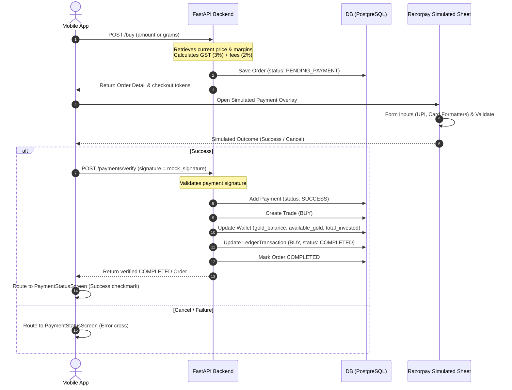
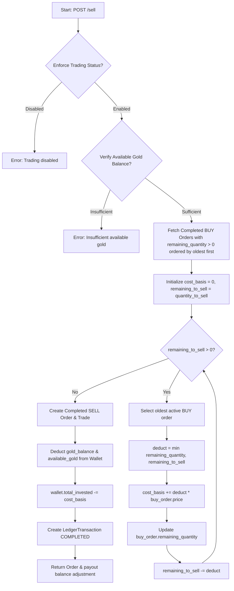

# Aura Gold

Production-ready Flutter (Mobile App) and FastAPI (Backend Service) platform for **Aura Gold**, featuring enterprise-grade gold trading workflows.

---

## Architecture & System Flow

Phase 3 implements the complete, end-to-end **Gold Trading Workflow** (Buy Gold, Sell Gold, Orders History, Timeline Tracing, Simulated Razorpay checkout sheets, and Admin settings).

### 1. Buy Gold & Razorpay Checkout Flow



### 2. Sell Gold FIFO PnL Cost-Basis Flow



---

## Directory Structure

```text
ags/
├── lib/                             # Flutter Mobile App
│   ├── core/                        # Network client, theme, responsive widgets
│   ├── routes/                      # GoRouter router definitions
│   └── features/
│       ├── buy_gold/                # Input forms, margins breakdown, review invoices
│       ├── sell_gold/               # Balance checking, sell max shortcut
│       ├── orders/                  # Filtered orders history lists
│       ├── payments/                # Razorpay checkout sheet overlay, status feedback
│       ├── settings/                # Admin margins and daily limits config
│       └── transaction_details/     # Vertical progress status timeline trace
├── backend/                         # FastAPI Backend
│   ├── app/
│   │   ├── models/trading.py        # SQLAlchemy Order, Payment, Trade, Settings tables
│   │   ├── schemas/trading.py       # Pydantic validation schema payloads
│   │   ├── services/trading_service.py # FIFO engines and payment verifications
│   │   └── api/v1/                  # API routers
│   └── tests/                       # Pytest unit testing suite
└── test/                            # Flutter testing suite (unit, widget, integration)
```

---

## How to Run & Verify

### 1. Running the FastAPI Backend

Make sure Python 3.12+ and PostgreSQL are installed.

```powershell
# Navigate and setup environment
cd backend
python -m venv .venv
.\.venv\Scripts\Activate.ps1

# Install requirements
pip install -e .[dev]

# Apply alembic migrations and database seeds
alembic upgrade head
python -m app.seed

# Start backend server
uvicorn app.main:app --reload
```

- Swagger docs will be hosted at: `http://localhost:8000/docs`
- Default Admin Account: `admin@auragold.com` / `Admin@123`
- Default User Account: `user@auragold.com` / `User@123`

### 2. Running the Flutter App

Ensure Flutter 3.x SDK is configured.

```powershell
# Get packages
flutter pub get

# Launch on developer emulator/device
flutter run
```

---

## Testing & Verification Suite

Automated pipelines cover backend business models, calculator functions, input states validations, and end-to-end integration workflows.

### 1. Executing Backend API & Engine Tests (Python)

Verifies GST rounding, daily cap resets, and the correctness of the FIFO profit calculations.

```powershell
cd backend
.venv\Scripts\pytest
```

### 2. Executing Frontend Tests (Flutter)

Compiles and triggers unit, widget, and integration test specifications.

```powershell
# Run the entire test suite (43 assertions)
flutter test

# Run individual specifications
flutter test test/buy_sell_unit_test.dart
flutter test test/trading_widgets_test.dart
flutter test test/trading_integration_test.dart
```
